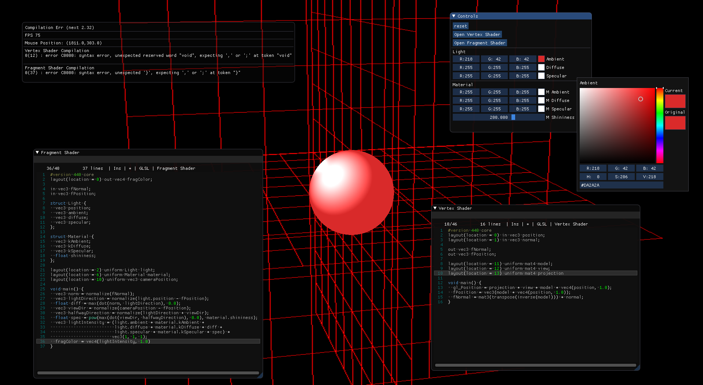
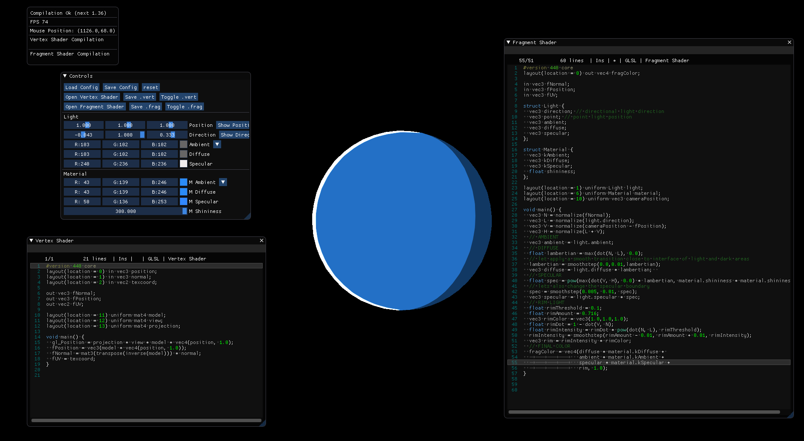
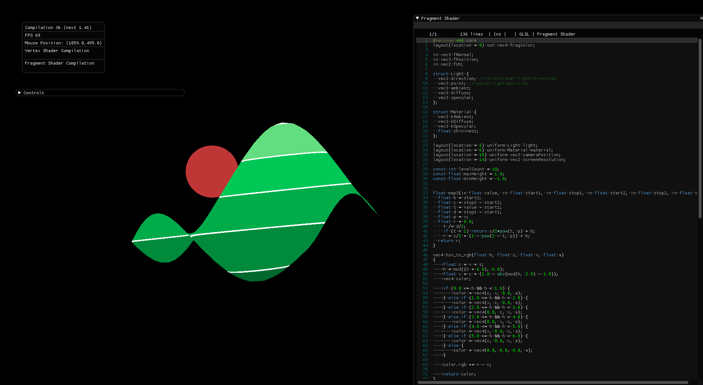
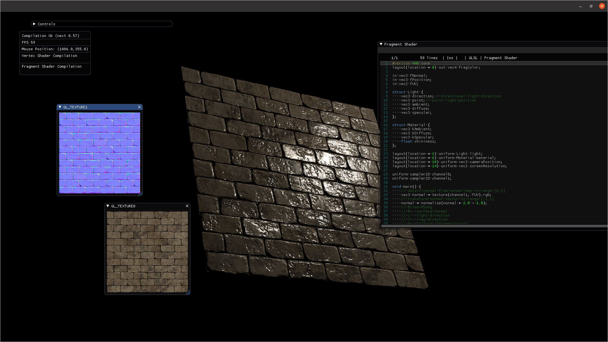
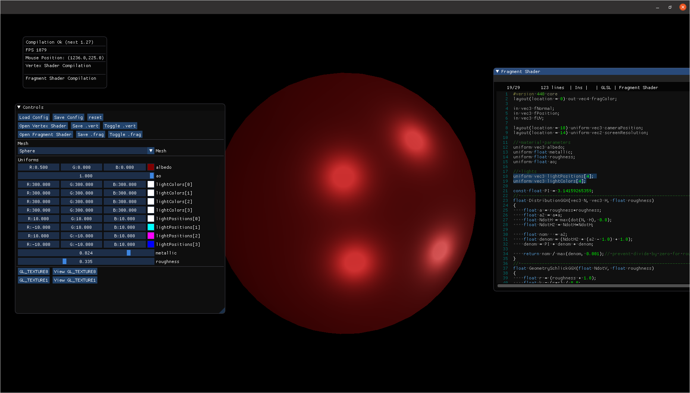

# glsl-experiments
This is just a simple playground app I built using some very helpful libs:

- [ImGuiFileDialog](https://github.com/aiekick/ImGuiFileDialog)
- [ImGuiColorTextEdit](https://github.com/BalazsJako/ImGuiColorTextEdit)
- [json11](https://github.com/dropbox/json11)

The idea is to conveniently load meshes and play/create with shader code inside the app.



## Build
    ```
    > mkdir build
    > cd build
    > cmake ..
    > make -j8
    > ./glsl_editor
    ```

Hopefully my cmake configurations will take care of all dependencies.

## Features
- Continuous compilation (error listing)
- Save/Load shader files (including a configuration file containing values of light/material)
- Visual cues for debugging (point light, directional light)
- Custom uniforms support (you can create uniforms (uniform arrays are supported as well))

## TODO
- Add other useful uniforms: time, mouse position, ~~camera position~~
- ~~Add texture support (more than one channel).~~
- Pass other mesh information to the shader as well.
- Incorporate [ImGuizmo](https://github.com/CedricGuillemet/ImGuizmo).
- Skybox/sphere allowing environment mapping.
- Shadows (add a floor to the scene).
- Save custom uniform values in config file.
- Load obj files.

## Screenshots




