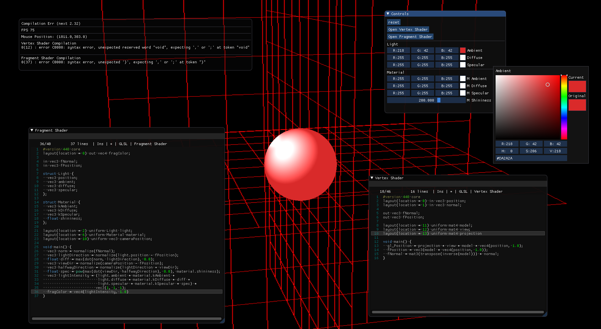

# glsl-experiments
This is just a simple playground app I built using some very helpful libs:

- [ImGuiColorTextEdit](https://github.com/BalazsJako/ImGuiColorTextEdit)

The idea is to conveniently load meshes and play with shader code inside the app.



## Build
    ```
    > mkdir build
    > cd build
    > cmake ..
    > make -j8
    > ./glsl_editor
    ```

Hopefully my cmake configurations will take care of all dependencies.

## TODO
- Add other useful uniforms such as time, mouse position, etc.
- Add texture support (more than one channel).
- Pass other mesh information to the shader as well.
- Incorporate [ImGuizmo](https://github.com/CedricGuillemet/ImGuizmo).